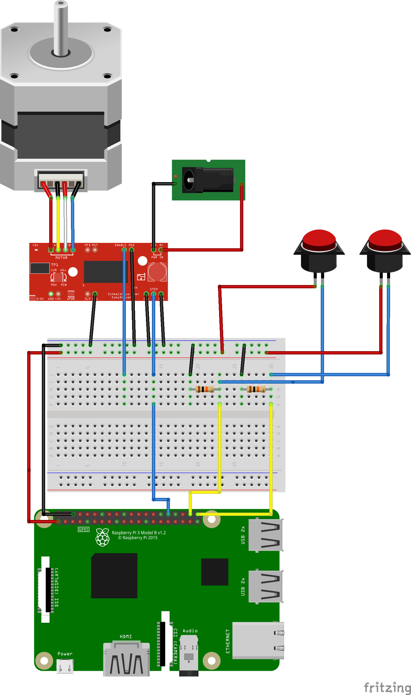

# akabeko_headban

## 作るもの
#### ヘドバン赤べこ
音楽に合わせてヘドバンする赤べこ．
何個かの音源をモードセレクトで選択し，モーターを音楽に合わせて駆動させ、接続された赤べこをヘドバンさせる．

# Language
- Python

 ### 実際使ったもの

 - モータードライバ (ステッピングモータ) ROB-12779
 - ステッピングモータ (UniP 5V)
 - DC 5V （ROB-12779でモーターを制御するのに必要な容量と電圧が必要)

 ### 配線図
 

## 音楽
全て [魔王魂](http://maoudamashii.jokersounds.com/) から引用.

### 1曲目
 - ネオロック83 (akabeko1.wav)
 - BPM == 80

### 2曲目
 - ネオロック57
 - BPM == 116

### 3曲目
 - ネオロック74 (akabeko3145.wav)
 - BPM == 145

## 開発に際して
このプロジェクト内にある全てのpythonスクリプトは [PEP8](https://pep8-ja.readthedocs.io/ja/latest/) に準拠したコーディングスタイルでLinterが走ってくれる。
これはgithub action上でチェックされるので、github actionで全てのチェックを通さないとマージすることは出来ない。

手元でgithub actionsが通るかどうかをチェックするためには [act](https://github.com/nektos/act) を使うと便利。

macの場合は `brew install act` でインストールが可能。 `brew` が使うことが出来ない環境等では以下のコマンドでインストールすることができる。

```
$ curl https://raw.githubusercontent.com/nektos/act/master/install.sh | sudo bash
```

※他のインストール方法等は公式のドキュメントを参照のこと

### actを使ったgithub actionの確認
actを使用する準備が出来たら act を使って実際にgithub actionsを手元で確認する。

プロジェクトルートで 

```
$ act
```

コマンドを実行すると、自動でgithub actionsが起動する。

自動でpep8がチェックされた後にはlintされた結果が出てくる。

```
| --- original/./connect_Raspi/comp.py
| +++ fixed/./connect_Raspi/comp.py
| @@ -20,61 +20,61 @@
|  # pin used in LED flush
|  GPIO.setup(12, GPIO.OUT)
|  
| -tmptime=30.0
| +tmptime = 30.0
|  
|  MUSICDIR = "/home/pi/akabeko_headban/music/"
|  
|  
|  try:
|      while True:
| -        if GPIO.input(20) == True:
| +        if GPIO.input(20):
|              game.init()
|              game.music.load(MUSICDIR + 'akabeko1.mp3')
|              game.music.play(1)
|              GPIO.output(23, True)
| -            intime=time.time()
| -            nowtime=intime
| +            intime = time.time()
| +            nowtime = intime
|  
```

`-` で示されている行で lint に失敗しているため `+` で示されているように変更する必要がある。

これでエラーが出ないように変更すれば実際に push して OK! 開発の補助にお役立て下さい！
